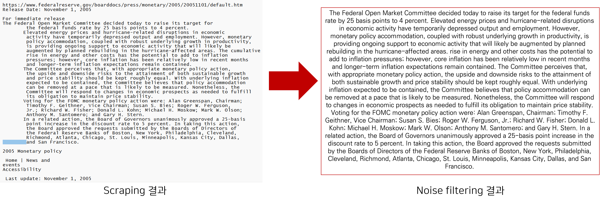
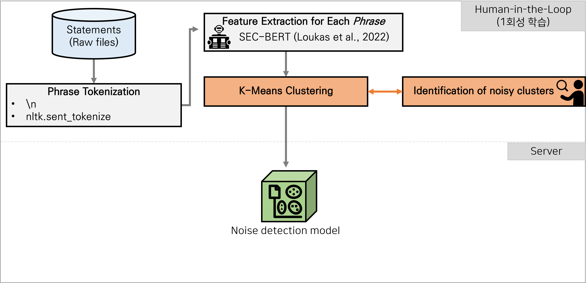
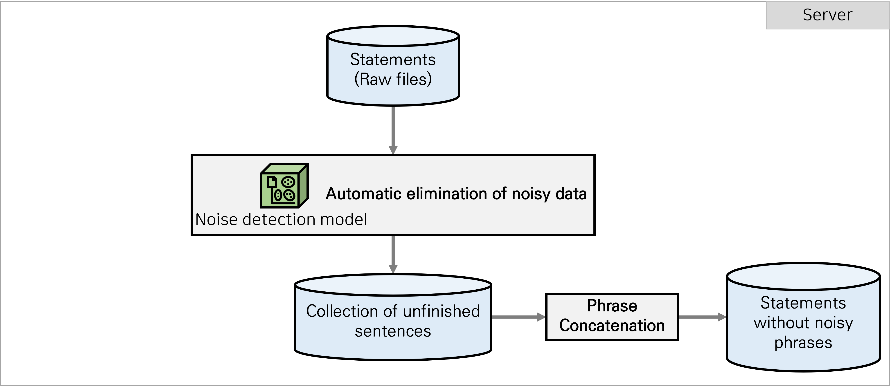

# Collect FOMC Statements

* Reference
    - Scraping: https://github.com/tengtengtengteng/Webscraping-FOMC-Statements
    - Data source: https://www.federalreserve.gov/monetarypolicy/fomccalendars.htm

### Scrape, clean, and save statements
```
python main_scrape_ane_clean_statements.py --start_mmddyyyy "09/01/2022" --end_mmddyyyy "11/09/2022"
```

### Cleaning


### Overview



### Noise detection model 
* 학습 데이터: 1990-01-01 ~ 2022-08-01 
    - 문서 수: 213개
    - Phrases 수: 3,372개
* Cluster 수: 50

* Full list of noisy clusters

|     Cluster index    |     Example sentence                                 |
|----------------------|------------------------------------------------------|
|     3                |     Home   \| Press releases                         |
|     4                |     Accessibility   \| Contact Us                    |
|     5                |     Last   update: April 20, 2007                    |
|     9                |     Implementation   Note issued March 16, 2016      |
|     12               |     Events                                           |
|     13               |     2005   Monetary policy                           |
|     20               |     For   immediate release                          |
|     26               |     Implementation   Note issued January 27, 2016    |
|     28               |     Release   Date: February 4, 1994                 |

