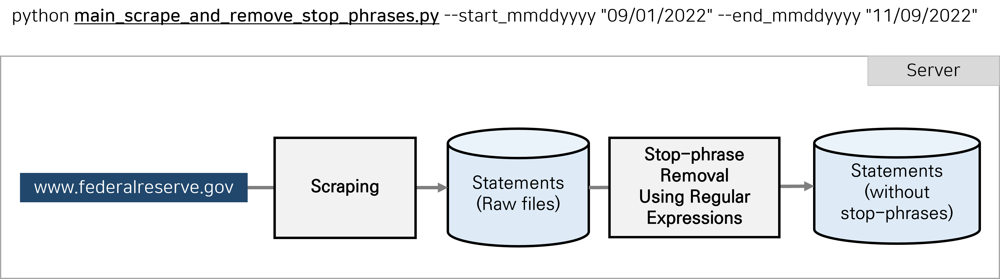
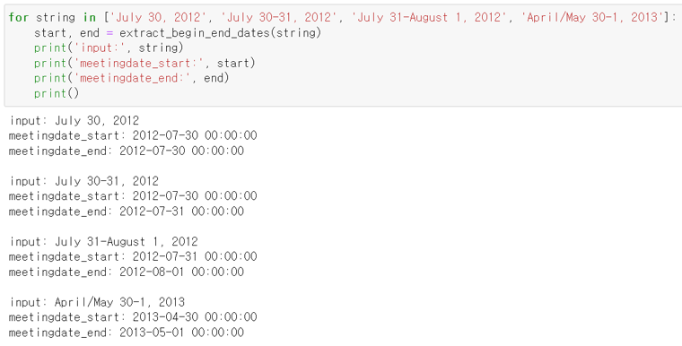

# Collecting FOMC Statements and Eliminating Stop-phrases

* For additional information, please contact us using the email addresses provided below.
    - sophia.jihyeparkk@gmail.com 
    - hjkim@bdai.snu.ac.kr

* Reference
    - Scraping: https://github.com/tengtengtengteng/Webscraping-FOMC-Statements
    - Data source: https://www.federalreserve.gov/monetarypolicy/materials/

* Tips
    - Regular expression online tester: https://pythex.org/

## Overview


### Input
| Variable           | Type | Example                                                             |
| :----------------- | :--- | :------------------------------------------------------------------ |
| start\_mmddyyyy    | str  | "01/01/1990"                                                        |
| end\_mmddyyyy      | str  | "11/17/2022"                                                        |
| insert\_into\_NRFDB      | str  | "False"                                                       |
| chromedriver_filepath | str  | "C:\\GIT\\SELENIUM\_DRIVERS\\chromedriver\_win32\\chromedriver.exe" |
| save\_root\_dir    | str  | "./Statements"                                                      |

## Full list of stop-phrase patterns
| Regular expression                                             | Stop-phrase example                                                                                                                                               |
| :--------------------------------------------------------------- | :---------------------------------------------------------------------------------------------------------------------------------------------------------------- |
| `Release Date: [A-z][a-z]{2,8} \d{1,2}, \d{4}` | Release Date: February 4, 1994 |
| `For immediate release`                          | For immediate release  |
| `Home \|.*`                                     | Home \| Press releases Accessibility \| Contact Us Last update: April 20, 2007, Home \| News and events Accessibility Last update: December 11, 2001          |
| `\d{4} Monetary policy`                         | 2005 Monetary policy |
| `Implementation Note issued.*`                  | Implementation Note issued January 27, 2016 |
| `Frequently Asked Questions.*`                  | Frequently Asked Questions for…<br>[Refer to <a href="https://www.federalreserve.gov/newsevents/pressreleases/monetary20191011a.htm">this page</a>] |
| `For media inquiries.*`                         | For media inquiries, call 202-452-2955. |
| `\(\d{1,3} KB PDF\)`                          | (61 KB PDF) |

* Before removing stop-phrases
```
Recent...and Christopher J. Waller. For media inquiries, please email [email protected] or call 202-452-2955. Implementation Note issued November 2, 2022
```

* After removing stop-phrases
```
Recent...and Christopher J. Waller. 
```

## Meeting date parsing

* extract_begin_end_dates() 함수 자체 개발
    - Input: 여러 가지 형식의 date range (Data type: string)
    - Output: meetingdate_start, meetingdate_end (Data type: datetime)

